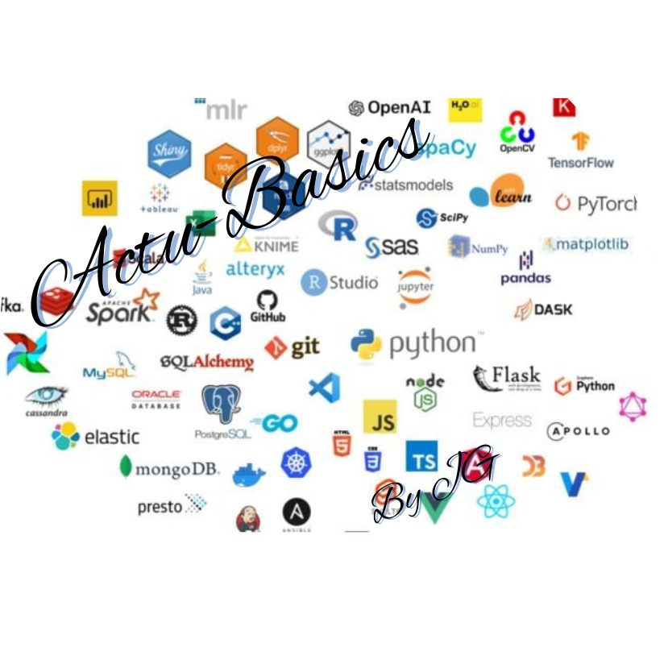

.. _Actu-Basics:

Actu-Basics
==============

Bienvenue dans l'index global du projet ActuBasics. Ce projet a pour objectif de fournir une compréhension approfondie des langages de programmation essentiels pour les Actuaires et Data Scientists. Ces langages jouent un rôle clé dans la manipulation des données, la modélisation des risques, et la prise de décision éclairée dans les domaines de l'actuariat et de la data science. À travers ce projet, vous découvrirez les langages de programmation les plus utilisés et les plus adaptés pour exceller dans ces professions.

Les compétences en programmation et en analyse des données sont essentielles pour exceller dans le domaine de l'actuariat et de la data science. Ce projet se concentre sur les langages les plus pertinents, chacun ayant des applications spécifiques et des avantages pour l’analyse des données, la modélisation statistique, et l'automatisation des processus.

I. **Python**

   Python est le langage de programmation central pour l’analyse des données, largement utilisé en actuariat et data science. Sa simplicité et la richesse de ses bibliothèques, telles que Pandas, NumPy, Matplotlib et Scikit-learn, en font un choix incontournable pour les professionnels de ces secteurs. 
   
   **Objectifs de la section Python** :
   - Maîtriser les bases de la syntaxe et des structures de contrôle en Python.
   - Appliquer Python pour manipuler des données, effectuer des analyses statistiques et créer des modèles prédictifs.

II. **R**

   R est particulièrement utilisé pour les statistiques avancées et la visualisation des données. Ce langage est très apprécié dans la recherche scientifique et les analyses statistiques complexes, y compris la modélisation et la prévision dans les secteurs financier et actuariel.

   **Objectifs de la section R** :
   - Découvrir les principes fondamentaux de R et ses bibliothèques principales (ggplot2, dplyr, etc.).
   - Apprendre à utiliser R pour effectuer des analyses statistiques et générer des visualisations interactives.

III. **SQL (Structured Query Language)**

   SQL est essentiel pour interroger et manipuler des bases de données relationnelles. Son rôle est fondamental dans l'extraction, la gestion et l'analyse des données stockées dans des bases de données volumineuses. En combinant SQL avec Python et R, vous pourrez tirer pleinement parti des bases de données pour vos analyses.

   **Objectifs de la section SQL** :
   - Apprendre à effectuer des requêtes pour extraire et analyser des données dans des bases de données relationnelles.
   - Intégrer SQL avec Python et R pour faciliter les analyses avancées de données.

IV. **SAS**

   SAS est une solution de programmation et de gestion de données largement utilisée dans le secteur de l’actuariat et des finances. Ce langage est privilégié pour les analyses statistiques de grande échelle, la gestion des risques et la modélisation financière.

   **Objectifs de la section SAS** :
   - Acquérir les bases de SAS pour manipuler et analyser de grandes quantités de données.
   - Utiliser les outils avancés de SAS pour la modélisation et la gestion des risques en actuariat.

V. **MATLAB**

   MATLAB est un langage de programmation utilisé principalement pour les calculs numériques et la modélisation. Très utilisé dans le domaine de la finance et de l’ingénierie, il permet de réaliser des simulations complexes, de modéliser des risques et d’effectuer des calculs mathématiques de manière performante.

   **Objectifs de la section MATLAB** :
   - Apprendre les bases de MATLAB pour effectuer des calculs numériques et des simulations.
   - Appliquer MATLAB à la modélisation des risques et aux analyses financières.

VI. **Julia**

   Julia est un langage de programmation récent qui se distingue par sa rapidité dans le traitement des données et les calculs numériques. Bien qu'il soit encore moins connu que Python ou R, il est particulièrement adapté aux calculs complexes et aux simulations en temps réel, ce qui en fait un excellent choix pour l’analyse de données massives et les simulations Monte Carlo.

   **Objectifs de la section Julia** :
   - Apprendre les bases de Julia et ses avantages pour les calculs numériques.
   - Utiliser Julia pour des simulations et analyses de données avancées.

Contenu du Projet
---------------------

Ce projet est structuré pour vous fournir une maîtrise des langages de programmation qui sont incontournables pour un Actuaire ou Data Scientist. Chaque section détaillera les bases du langage, ses applications dans l’analyse des données, et son intégration avec les outils statistiques et les bases de données.

**Sections disponibles :**

- **Python** : Introduction aux bases du langage et aux bibliothèques essentielles pour l'analyse des données.

- **R** : Apprentissage des techniques statistiques et de visualisation.

- **SQL** : Maîtrise des bases de données relationnelles pour extraire et analyser des données.

- **SAS** : Utilisation de SAS pour des analyses statistiques avancées dans le domaine de l’actuariat.

- **MATLAB** : Modélisation et calculs numériques pour des simulations financières et actuarielles.

- **Julia** : Calculs complexes et simulations avec un langage performant.

Les sections sont accompagnées d’exemples pratiques, de cas d’utilisation et de conseils pour vous aider à maîtriser les compétences nécessaires à votre développement professionnel dans le domaine de l’actuariat et de la data science.

.. toctree::
   :maxdepth: 1
   :caption: Voir :

   python/index
   r/index
   sql/index
   sas/index
   matlab/index
   julia/index
